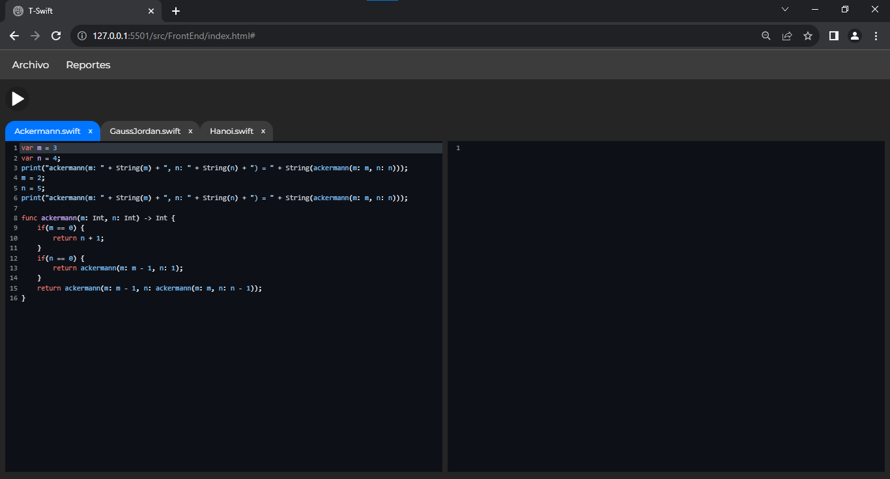
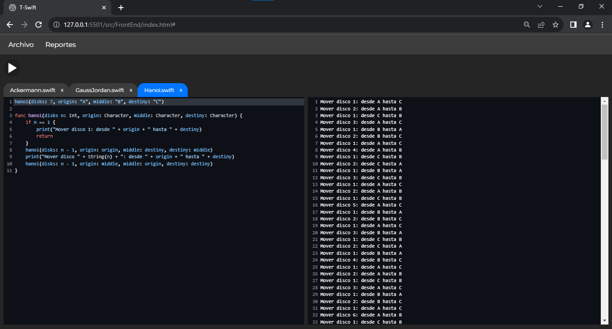
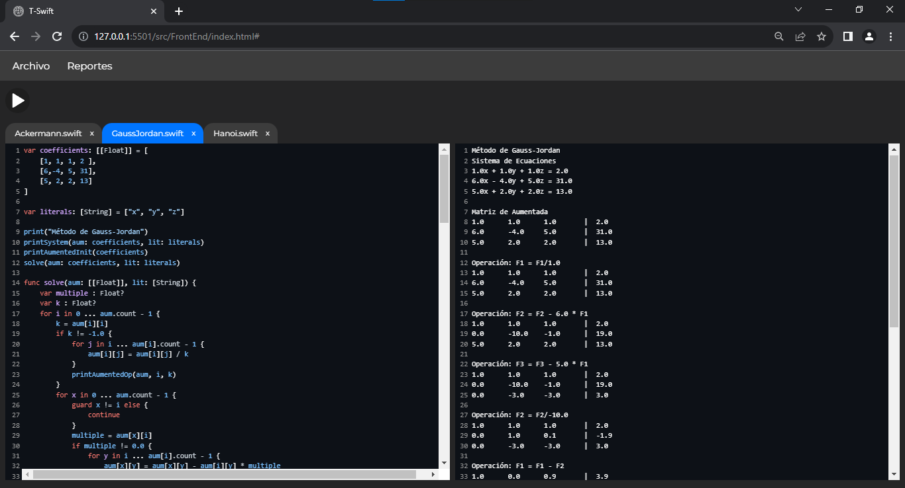
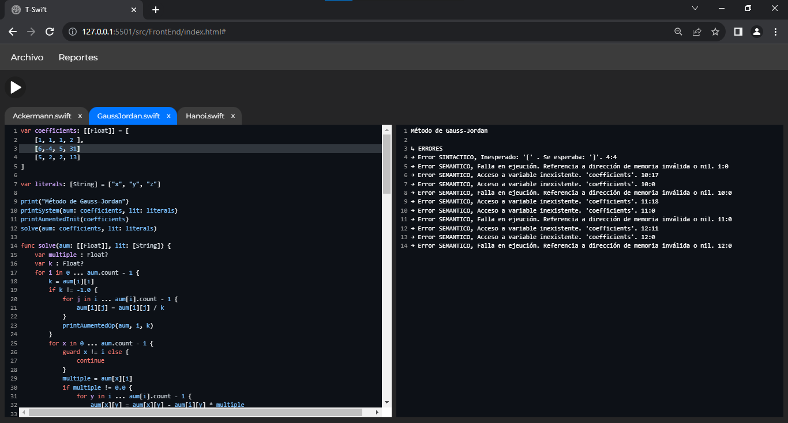
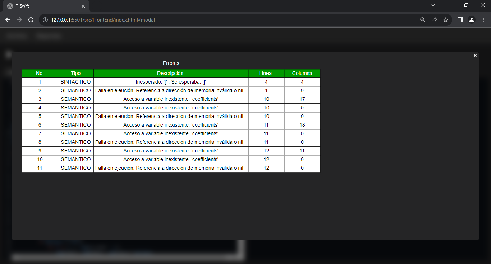
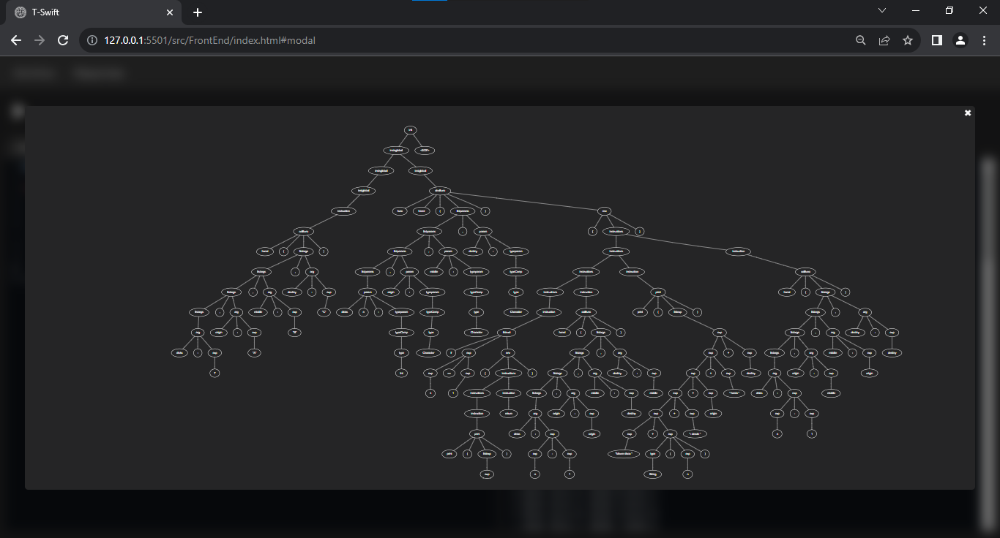
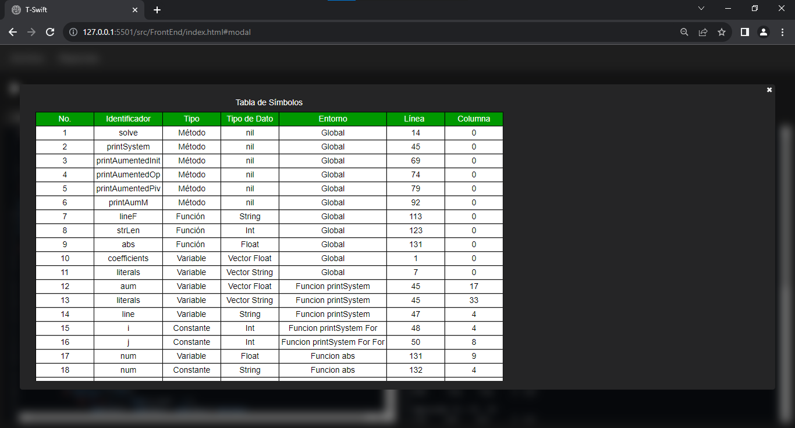
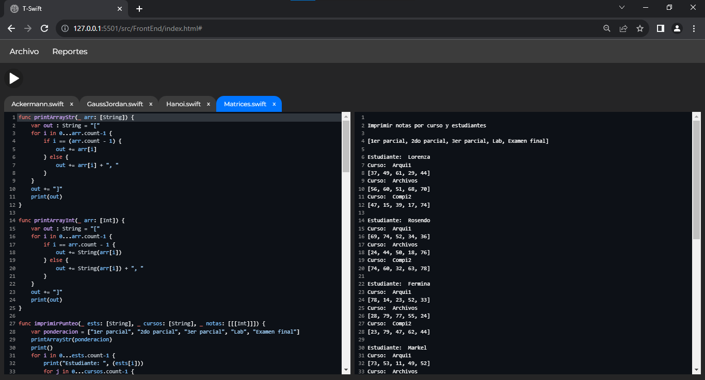
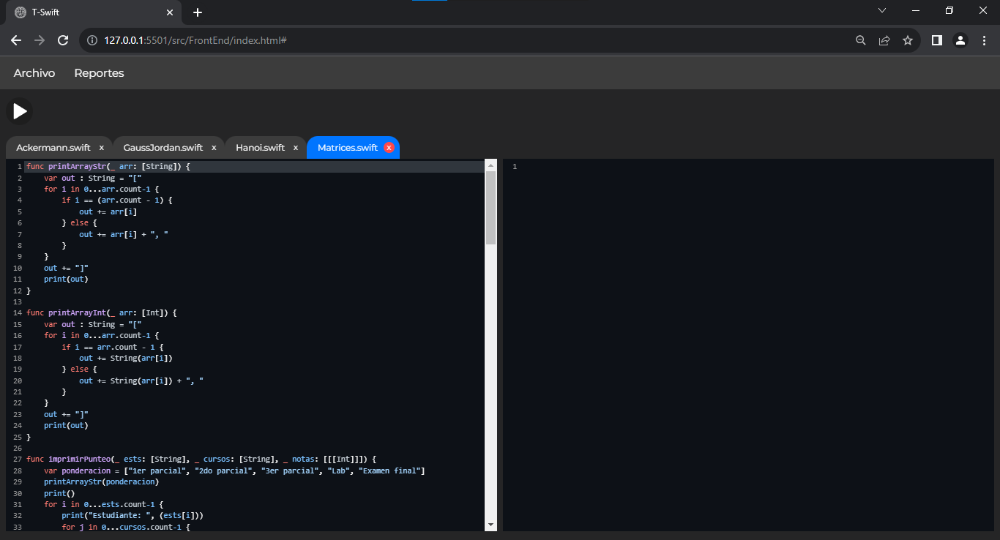

# Proyecto 1 OLC2 2S 2023

## 201908355 - Danny Hugo Bryan Tejaxún Pichiyá

## T-Swift

## Manual de Usuario

## Índice

1. [Ejecutar Código](#1-ejecutar-código)
2. [Consola](#2-consola)
3. [Reporte De Errores](#3-reporte-de-errores)
4. [CST](#4-cst)
5. [Tabla De Símbolos](#5-tabla-de-símbolos)
6. [Sintaxis](#6-sintaxis)
7. [Sistema de Pestañas](#7-sistema-de-pestañas)

## 1. Ejecutar Código
* ### Para Ejecutar el código se debe hacer click en el botón de Play.



* ### Es posible tener más de un archivo abierto simultáneamente. [Ver Sistema de Pestañas](#7-sistema-de-pestañas).



[Subir](#manual-de-usuario)

## 2. Consola
* ### En la consola es posible visualizar todo lo que reciba el argumento de la función nativa print.



* ### En caso de haber errores Sintácticos o Semánticos se mostrarán en consola.



[Subir](#manual-de-usuario)

## 3. Reporte De Errores
* ### En caso de haber errores Sintácticos o Semánticos se puede generar un reporte y puede visualizarse seleccionando la opción correspondiente del menú Reportes.



[Subir](#manual-de-usuario)

## 4. CST
* ### Al haber código en el editor se puede generar un reporte del CST y puede visualizarse seleccionando la opción correspondiente del menú Reportes.



[Subir](#manual-de-usuario)

## 5. Tabla De Símbolos
* ### Al ejecutar el código escrito en el editor se puede visualizar un reporte de la Tabla de Símbolos seleccionando la opción correspondiente del menú Reportes.



[Subir](#manual-de-usuario)

## 6. Sintaxis

* Declaración de Variables
```swift
var id: type = value
var id: [[type]] = value
var id: [type] = value
var id: type?
var id = value
```
* Declaración de Métodos y Funciones
```swift
func id((externName|_)? param1 : type,(externName|_)? param2: type, ... (externName|_)? paramN: type) -> type {
    //instrucciones
    return expression
}
func id((externName|_)? param1 : type,(externName|_)? param2: type, ... (externName|_)? paramN: type) {
    //instrucciones
}
func id() -> type {
    //instrucciones
    return expression
}
func id() {
    //instrucciones
}
```
* Ciclos
```swift
for id in limInf ... limSup {
    //instrucciones
}
for id in id {
    //instrucciones
}
while condición {
    //instrucciones
}
```
* Estructuras de Control
```swift
//if else if                //if else                   //if
if condicion {             if condicion {             if condicion {
    //instrucciones             //instrucciones             //instrucciones
}                          }                          }
else if condicion {        else {
    //instrucciones             //instrucciones
}                          }
...
else {
    //instrucciones
}

//switch
switch expresion {
    case expresion:
        //instrucciones
    case expresion:
    case expresion:
    ...
    case expresion:
        //instrucciones
    default:
        //instrucciones
}
```
* Casteo
```java
var id: type = type(expresion)
var id = type(expresion)
```

[Subir](#manual-de-usuario)

## 7. Sistema de Pestañas
* ### Mediante el Sistema de Pestañas es posible trasladarse entre proyectos del Lenguaje TypeWise.



* ### Es posible eliminar pestañas cuando ya no se requiera editar el código de algún proyecto.



[Subir](#manual-de-usuario)

## TypeWise

## Manual Técnico

## Índice

1. [Análisis Léxico Y Sintáctico](#1-análisis-léxico-y-sintáctico)
2. [Tipos De Datos](#2-tipos-de-datos)
    1. [Tipo Dominante En Operaciones Aritméticas](#2.1-tipo-dominante-en-operaciones-aritméticas)
    2. [Tipos De Retorno](#2.2-tipos-de-retorno)
3. [Clases Abstractas](#3-clases-abstractas)
4. [Entornos](#4-entornos)

## 1. Análisis Léxico Y Sintáctico
* [Ver Expresiones Regulares y Gramática](./Gramatica.md)

## 2. Tipos De Datos
```go
type Type int

const (
	INT Type = iota
	FLOAT
	STRING
	BOOLEAN
	CHAR
	NIL
	VECTOR
	MATRIX
)

```
[Subir](#manual-técnico)


## 2.1. Tipo Dominante En Operaciones Aritméticas
### 2.1.1. Suma
|    +    |  INT   | DOUBLE | STRING |
|    -    |   -    |   -    |   -    |
| INT     | INT    | DOUBLE | NIL    |
| DOUBLE  | DOUBLE | DOUBLE | NIL    |
| STRING  | NIL    | NIL    | STRING |

[Subir](#manual-técnico)

### 2.1.2. Resta
|    -    | INT    | DOUBLE |
|    -    |   -    |   -    |
| INT     | INT    | DOUBLE |
| DOUBLE  | DOUBLE | DOUBLE |

[Subir](#manual-técnico)

### 2.1.3. Multiplicación
|    *    | INT    | DOUBLE |
|    -    |   -    |   -    |
| INT     | INT    | DOUBLE |
| DOUBLE  | DOUBLE | DOUBLE |

[Subir](#manual-técnico)

### 2.1.4. División
|    /    | INT    | DOUBLE |
|    -    |   -    |   -    |
| INT     | INT    | DOUBLE |
| DOUBLE  | DOUBLE | DOUBLE |

[Subir](#manual-técnico)

### 2.1.6. Módulo
|    %    | INT    |
|    -    |   -    |
| INT     | INT    |

[Subir](#manual-técnico)

## 2.2. Tipos De Retorno
Es el tipo que retorna cada Expresión para tener referencia, no solo del valor sino también del tipo de dato resultante.
```go
type ReturnType struct {
	Value interface{}
	Type  Type
}
```
[Subir](#manual-técnico)

## 3. Interfaces

## 3.1. Expresión
* Se implementó la clase Expression que es la clase padre de todas aquellas funcionalidades del lenguaje TypeWise que retornan un valor, tales como:
 
    * Llamada a Función
    * Acceso a Variables
        - Primitivas
        - Posiciones de Vectores
        - Posiciones de Matrices
    * Sentencia 'Return'
    * Operaciones
        - Aritméticas
        - Relacionales
        - Lógicas
    * Funciones Embebidas
        - String
        - Int
        - Float
    * Casteo

Es necesario que cada expresión tenga una referencia de los entornos globales relativamente, ya que desde un bloque de código interno se puede acceder a las variables y funciones de los entornos más globales.

```go
type Expression interface {
	LineN() int
	ColumnN() int
	Exec(env *env.Env) *utils.ReturnType
}
```
[Subir](#manual-técnico)

## 3.2. Instrucción
* Se implementó la clase Instruction que es la clase padre de todas aquellas funcionalidades del lenguaje TypeWise que no retornan un valor, tales como:
    * Función Append propia de los Vectores
    * Inicialización de Variables
        - Primitivas
        - Vectores
        - Matrices
    * Sentencias de Transferencia
        - Continue
        - Break
    * Reasignación de Valores
        - Variables Primitivas
        - Posiciones de Vectores
        - Posiciones de Matrices
    * Declaración de Funciones
    * Estructuras de Control
        - If
        - Else If
        - Else
        - Guard
        - Switch Case
        - Ciclos
            * For
            * While
    * Bloques de Instrucciones

Es necesario que cada instrucción tenga una referencia de los entornos globales relativamente, ya que desde un bloque de código interno se puede acceder a las variables y funciones de los entornos más globales.

```go
type Instruction interface {
	LineN() int
	ColumnN() int
	Exec(env *env.Env) *utils.ReturnType
}
```
[Subir](#manual-técnico)

## 4. Entornos
En el entorno se guarda la referencia hacia cada variable, arreglo, método o función declarada.
* Para declarar una variable nueva primero se debe verificar que no exista previamente, en el Map de identificadores del entorno, una variable con el mismo nombre sin importar el tipo.
```go
func (env *Env) SaveID(isVariable bool, id string, value *utils.ReturnType, Type utils.Type, line, column int) bool {
	if _, exists := (*env.Ids)[id]; !exists {
		(*env.Ids)[id] = &Symbol{IsVariable: isVariable, IsPrimitive: true, Value: value, Id: id, Type: Type}
		SymTable.Push(NewSymTab(line, column, isVariable, true, id, env.Name, Type, utils.NIL))
		return true
	}
	env.SetError("Redeclaración de variable existente", line, column)
	return false
}
```
[Subir](#manual-técnico)

* Para declarar un vector nuevo de n dimensiones primero se debe verificar que no exista o esté declarada previamente, en el Map de identificadores del entorno, una variable con el mismo nombre sin importar el tipo.
```go
func (env *Env) SaveArray(isVariable bool, id string, value interface{}, Type utils.Type, line, column int) bool {
	if _, exists := (*env.Ids)[id]; !exists {
		(*env.Ids)[id] = &Symbol{IsVariable: isVariable, IsPrimitive: false, Value: value, Id: id, Type: utils.VECTOR, ArrType: Type}
		SymTable.Push(NewSymTab(line, column, isVariable, false, id, env.Name, utils.VECTOR, Type))
		return true
	}
	env.SetError("Redeclaración de variable existente", line, column)
	return false
}
```
[Subir](#manual-técnico)

* Para obtener el valor de una variable es necesario hacer una búsqueda en el Map de identificadores de cada entorno comenzando por el entorno local. En caso de no encontrar el identificador en el entorno local es necesario ascender de entornos hasta encontrar el identificador de la variable, si es que se declaró previamente.
```go
func (env *Env) GetValueID(id string, line, column int) *Symbol {
	var current *Env = env
	for current != nil {
		if _, exists := (*current.Ids)[id]; exists {
			return (*current.Ids)[id]
		}
		current = current.previous
	}
	current.SetError(fmt.Sprintf("Acceso a variable inexistente. '%s'", id), line, column)
	return nil
}
```
[Subir](#manual-técnico)

* Para obtener el valor de una posición de un vector es necesario hacer una búsqueda en el Map de identificadores de cada entorno comenzando por el entorno local. En caso de no encontrar el identificador en el entorno local es necesario ascender de entornos hasta encontrar el identificador de la variable, si es que se declaró previamente. Si existe se utiliza la lista de índices que fue enviada como parámetro para encontrar una posición específica del vector.
```go
func (v *Vector) GetPosition(env *env.Env, indexs []int, line, column int) interface{} {
	if len(indexs) > v.Dims {
		env.SetError("Las dimensiones no coinciden con las del vector", line, column)
		return nil
	}
	if len(indexs) == 1 {
		if v.IsMatrix {
			if indexs[0] >= 0 && indexs[0] < len(v.Vectors) {
				return v.Vectors[indexs[0]]
			}
			env.SetError("Índices fuera de rango", line, column)
			return nil
		}
		if indexs[0] >= 0 && indexs[0] < len(v.Values) {
			return v.Values[indexs[0]]
		}
		env.SetError("Índices fuera de rango", line, column)
		return nil
	}
	if indexs[0] >= 0 && indexs[0] < len(v.Vectors) {
		return v.Vectors[indexs[0]].GetPosition(env, indexs[1:], line, column)
	}
	env.SetError("Índices fuera de rango", line, column)
	return nil
}
```
[Subir](#manual-técnico)

* Para reasignar un nuevo valor a una variable previamente declarada es necesario hacer una búsqueda en el Map de identificadores de cada entorno comenzando por el entorno local. En caso de no encontrar el identificador en el entorno local es necesario ascender de entornos hasta encontrar el identificador de la variable, si es que se declaró previamente. Si existe se le asigna el nuevo valor
```go
func (env *Env) ReasignID(id string, value *utils.ReturnType, line, column int) bool {
	var current *Env = env
	for current != nil {
		if _, exists := (*current.Ids)[id]; exists {
			if (*current.Ids)[id].IsVariable {
				if (*current.Ids)[id].Type == value.Type || (*current.Ids)[id].Type == utils.STRING && value.Type == utils.CHAR || (*current.Ids)[id].Type == utils.FLOAT && value.Type == utils.INT {
					(*current.Ids)[id].Value = value
					return true
				}
				current.SetError(fmt.Sprintf("Los tipos no coinciden en la asignación. Intenta asignar un \"%v\" a un \"%v\"", current.getType(value.Type), current.getType((*current.Ids)[id].Type)), line, column)
				return false
			}
			current.SetError("Resignación de valor a constante", line, column)
			return false
		}
		current = current.previous
	}
	current.SetError("Resignación de valor a variable inexistente", line, column)
	return false
}
```
[Subir](#manual-técnico)

* Para reasignar un nuevo valor a una posición de un vector es necesario hacer una búsqueda en el Map de identificadores de cada entorno comenzando por el entorno local. En caso de no encontrar el identificador en el entorno local es necesario ascender de entornos hasta encontrar el identificador de la variable, si es que se declaró previamente. Si existe se utiliza la lista de índices que fue enviada como parámetro para encontrar una posición específica del vector y reasignarle el nuevo valor.
```go
func (v *Vector) SetValuePosition(env *env.Env, indexs []int, newValue interfaces.Expression, line, column int) bool {
	if len(indexs) > v.Dims {
		env.SetError("Las dimensiones no coinciden con las del vector", line, column)
		return false
	}
	if len(indexs) == 1 {
		if v.IsMatrix {
			if indexs[0] >= 0 && indexs[0] < len(v.Vectors) {
				env.SetError("Solo puede modificarse un elemento a la vez en un vector", line, column)
				return false
			}
			env.SetError("Índices fuera de rango", line, column)
			return false
		}
		if indexs[0] >= 0 && indexs[0] < len(v.Values) {
			if v.Values[indexs[0]].Type == newValue.Exec(env).Type {
				v.Elements[indexs[0]] = newValue
				v.Values[indexs[0]] = newValue.Exec(env)
				return true
			}
			env.SetError("El tipo del nuevo valor no coincide con el que almacena el vector", line, column)
			return false
		}
		env.SetError("Índices fuera de rango", line, column)
		return false
	}
	if indexs[0] >= 0 && indexs[0] < len(v.Vectors) {
		return v.Vectors[indexs[0]].SetValuePosition(env, indexs[1:], newValue, line, column)
	}
	env.SetError("Índices fuera de rango", line, column)
	return false
}
```
[Subir](#manual-técnico)

* Para insertar un nuevo valor en una lista es necesario hacer una búsqueda en el Map de identificadores de cada entorno comenzando por el entorno local. En caso de no encontrar el identificador en el entorno local es necesario ascender de entornos hasta encontrar el identificador de la variable, si es que se declaró previamente. Si existe se inserta el nuevo valor al vector.
```go
func (a *Append) Exec(env *env.Env) *utils.ReturnType {
	vec := env.GetValueID(a.ID, a.Line, a.Column)
	if vec.Type == utils.VECTOR {
		newValue := a.Exp.Exec(env)
		if newValue.Type == vec.ArrType {
			vec.Value.(*vector.Vector).Elements = append(vec.Value.(*vector.Vector).Elements, a.Exp)
			vec.Value.(*vector.Vector).Values = append(vec.Value.(*vector.Vector).Values, a.Exp.Exec(env))
			vec.Value.(*vector.Vector).Length += 1
			return nil
		}
		env.SetError("El tipo de dato del nuevo valor no es el mismo que almacena el vector", a.Line, a.Column)
		return nil
	}
	env.SetError("El método 'append' es exclusivo de vectores", a.Line, a.Column)
	return nil
}
```
[Subir](#manual-técnico)

* Para declarar una función o método nueva primero se debe hacer una búsqueda en el Map de funciones del entorno global. En caso de no encontrar el identificador de la función en el entorno global se guarda la nueva función.
```go
func (env *Env) SaveFunction(id string, Func *interface{}, Type utils.Type, line, column int) bool {
	if _, exists := (*env.Functions)[id]; !exists {
		(*env.Functions)[id] = Func
		SymTable.Push(NewSymTab(line, column, false, false, id, env.Name, Type, utils.NIL))
		return true
	}
	env.SetError("Redefinición de función existente", line, column)
	return false
}
```
[Subir](#manual-técnico)

* Para obtener una función o método, para posteriormente ejecutarla, primero se debe hacer una búsqueda en el Map de funciones del entorno global. En caso de no encontrar el identificador de la función en el entorno global no se retorna nada.
```go
func (env *Env) GetFunction(id string, line, column int) *interface{} {
	if _, exists := (*env.Functions)[id]; exists {
		return (*env.Functions)[id]
	}
	env.SetError("Acceso a función inexistente", line, column)
	return nil
}
```
[Subir](#manual-técnico)

* Para obtener el entorno global es necesario ir ascendiendo desde el entorno local actual hasta que ya no exista un entorno global relativo del entorno actual.
```go
func (env *Env) GetGlobal() *Env {
	current := env
	for current.previous != nil {
		current = current.previous
	}
	return current
}
```
[Subir](#manual-técnico)